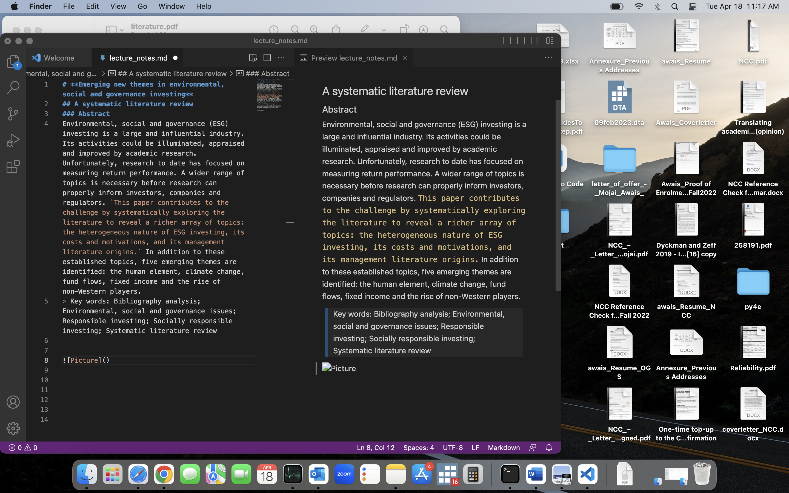

# **Emerging new themes in environmental, social and governance investing**
## A systematic literature review
### Author: Dan Daugaard 
#### Abstract
Environmental, social and governance (ESG) investing is a large and influential industry. Its activities could be illuminated, appraised and improved by academic research. Unfortunately, research to date has focused on measuring return performance. A wider range of topics is necessary before research can properly inform investors, companies and regulators. `This paper contributes to the challenge by systematically exploring the literature to reveal a richer array of topics: the heterogeneous nature of ESG investing, its costs and motivations, and its management literature origins.` In addition to these established topics, five emerging themes are identified: the human element, climate change, fund flows, fixed income and the rise of non-Western players.
> Key words: Bibliography analysis; Environmental, social and governance issues; Responsible investing; Socially responsible investing; Systematic literature review

